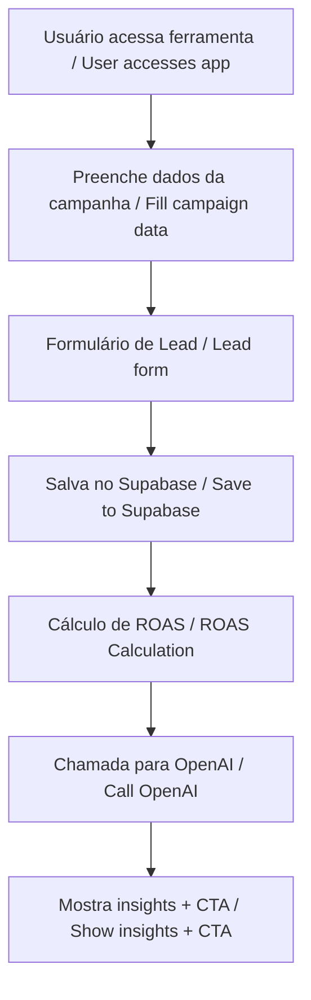

# 📊 Microsaas de Análise de ROAS com IA + Captura de Leads  
> 💼 Projeto técnico desenvolvido para o processo seletivo da CloudWalk

---

## 🔗 Projeto Online

🌐 [https://case-cloudwalk-roas-microsaas.vercel.app](https://case-cloudwalk-roas-microsaas.vercel.app)

---

## 📦 Funcionalidades

- ✨ Calculadora de ROAS (Return on Ad Spend): o usuário informa o quanto investiu e quanto lucrou, e o sistema calcula o ROAS automaticamente (ROAS = Receita ÷ Investimento).
- 🧠 Geração de insights com inteligência artificial (OpenAI): o backend envia os dados da campanha para a OpenAI e recebe recomendações personalizadas.
- 📬 Captura de leads (nome + e-mail): obrigatória antes de exibir os resultados, garantindo geração de leads para uso comercial.
- 🚀 Banner estratégico da InfinitePay: após os resultados, é exibido um CTA discreto incentivando o cadastro na InfinitePay.
- 🔐 Backend seguro com Supabase: todas as requisições sensíveis são feitas pelo servidor (nunca pelo client), e os dados são armazenados em um banco seguro.

---

## 🛠️ Como Rodar Localmente (🇧🇷)

### ⚙️ Pré-requisitos

Antes de começar, você precisa ter instalado:

- Node.js 18 ou superior
- npm ou Yarn
- Conta no [Supabase](https://supabase.io/)
- Chave de API da [OpenAI](https://platform.openai.com/account/api-keys)

### 🚀 Passos para rodar o projeto

1. Clone o repositório do projeto:

```bash
git clone https://github.com/caua2006/case-cloudwalk-roas-microsaas.git
cd <nome-do-projeto>
```

2. Instale as dependências:

```bash
npm install
# ou
yarn
```

3. Crie um arquivo `.env` com suas variáveis de ambiente:

```env
NEXT_PUBLIC_SUPABASE_URL=https://<project>.supabase.co
NEXT_PUBLIC_SUPABASE_ANON_KEY=your_anon_key
SUPABASE_SERVICE_ROLE_KEY=your_service_role_key
OPENAI_API_KEY=your_openai_key
```

> ❗ Importante: substitua `<projeto>` e as chaves pelas informações reais do seu projeto Supabase e OpenAI.

4. Rode o servidor de desenvolvimento:

```bash
npm run dev
# ou
yarn dev
```

5. Acesse o projeto localmente em: [http://localhost:3000](http://localhost:3000)

---

## 🇺🇸 How to Run Locally (English)

### ⚙️ Requirements

Before you start, make sure you have:

- Node.js 18+
- npm or Yarn
- [Supabase](https://supabase.io/) account
- [OpenAI](https://platform.openai.com/account/api-keys) API key

### 🚀 Steps to run the project

1. Clone the repository:

```bash
git clone <your-repo-url>
cd <your-project>
```

2. Install dependencies:

```bash
npm install
# or
yarn
```

3. Create a `.env` file with:

```env
NEXT_PUBLIC_SUPABASE_URL=https://<project>.supabase.co
NEXT_PUBLIC_SUPABASE_ANON_KEY=your_anon_key
SUPABASE_SERVICE_ROLE_KEY=your_service_role_key
OPENAI_API_KEY=your_openai_key
```

> ⚠️ Replace the values with your actual Supabase and OpenAI credentials.

4. Start the dev server:

```bash
npm run dev
# or
yarn dev
```

5. Visit: [http://localhost:3000](http://localhost:3000)

---

## 🧬 Fluxo da Aplicação / App Flow



---

## 🧠 Prompt da IA (usado na OpenAI)

```text
Você é um especialista em marketing digital. Avalie a campanha:

Investimento: R$ {valor}
Receita: R$ {valor}
ROAS: {valor}

1. Classifique como “ótimo”, “bom” ou “ruim”.
2. Justifique brevemente.
3. Dê 2 ou 3 recomendações práticas.
```

> Este prompt é enviado à API da OpenAI para gerar os insights personalizados com base nos dados da campanha.

---

## 🧾 Supabase: Estrutura do Banco / Database Schema

### 📌 Tabela: `leads`

| Campo        | Tipo     | Descrição               |
|--------------|----------|--------------------------|
| id           | uuid     | Identificador único     |
| nome / name  | text     | Nome do usuário         |
| email        | text     | E-mail do lead          |
| nomeNegocio / businessName | text | Nome do negócio (opcional) |
| criado_em / created_at | timestamp | Data de criação       |

### 📌 Tabela: `analises` / `analyses`

| Campo         | Tipo     | Descrição                          |
|---------------|----------|-------------------------------------|
| id            | uuid     | ID da análise                      |
| lead_id       | uuid     | Chave estrangeira para o lead      |
| investimento / investment | decimal | Valor investido             |
| receita / revenue | decimal | Receita obtida               |
| roas          | decimal  | ROAS calculado                    |
| insights      | text     | Texto gerado pela IA              |
| criado_em / created_at | timestamp | Data da análise             |

---

## 🧪 Tecnologias Utilizadas / Tech Stack

| Tecnologia        | Função / Purpose             |
|-------------------|------------------------------|
| ⚛️ Next.js         | Frontend + Backend (API)      |
| 🛢️ Supabase        | Banco de dados / Database     |
| ☁️ Vercel          | Deploy                       |
| 🤖 OpenAI API      | Geração de insights / AI      |

---

## 📋 Entregáveis Confirmados / Deliverables Checklist

| Entregável / Deliverable                  | Status |
|-------------------------------------------|--------|
| Projeto online / Live project             | ✅     |
| Cálculo de ROAS / ROAS calculation        | ✅     |
| Captura de Leads / Lead capture           | ✅     |
| Geração de insights com IA / AI insights  | ✅     |
| Integração InfinitePay / InfinitePay CTA  | ✅     |
| Backend seguro / Secured backend          | ✅     |
| Documentação técnica / Documentation      | ✅     |

---

## 📝 Licença / License

Este projeto é de uso exclusivo para fins de avaliação técnica no processo seletivo da CloudWalk.  
This project is intended exclusively for technical evaluation during the CloudWalk selection process.
